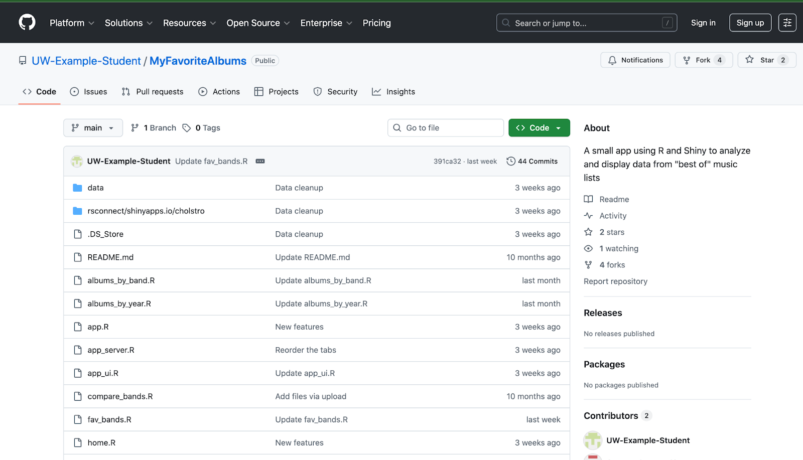
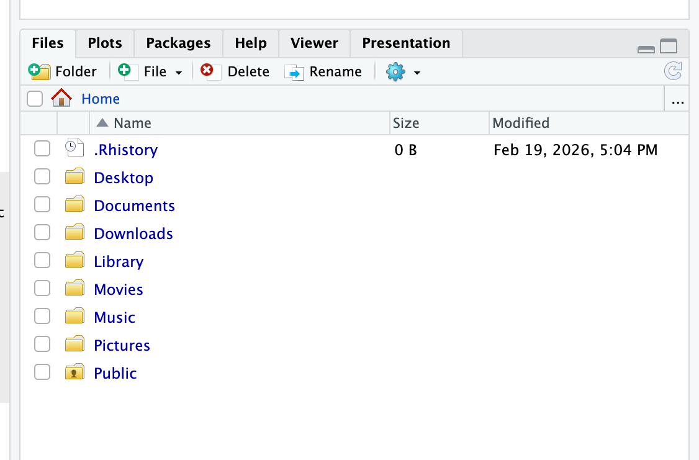
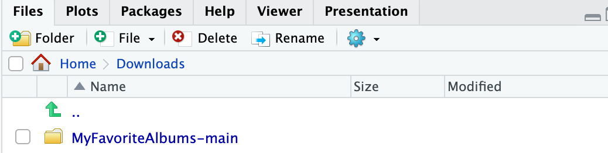
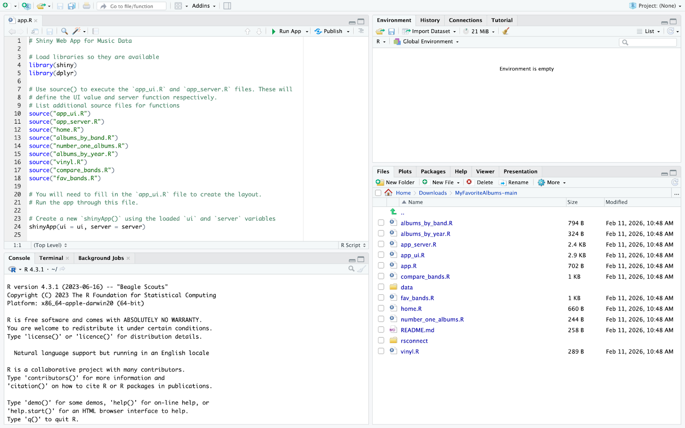
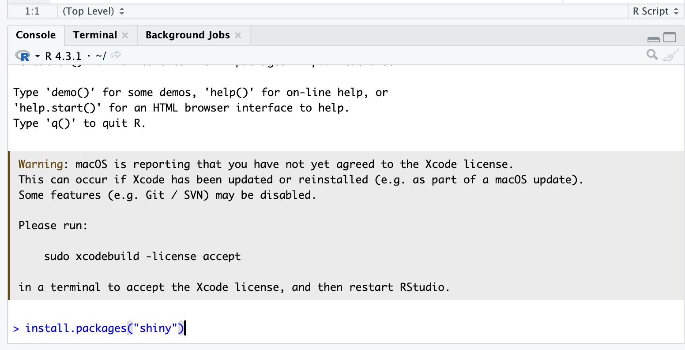
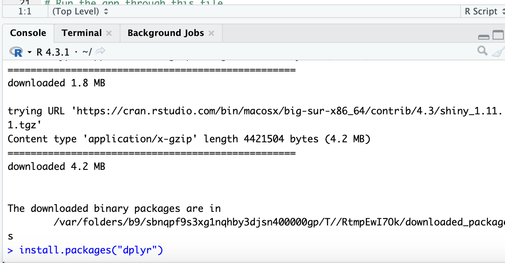
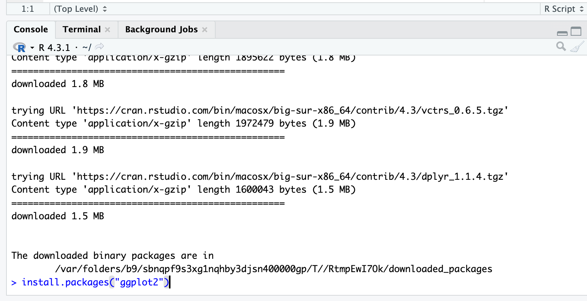
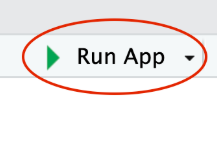
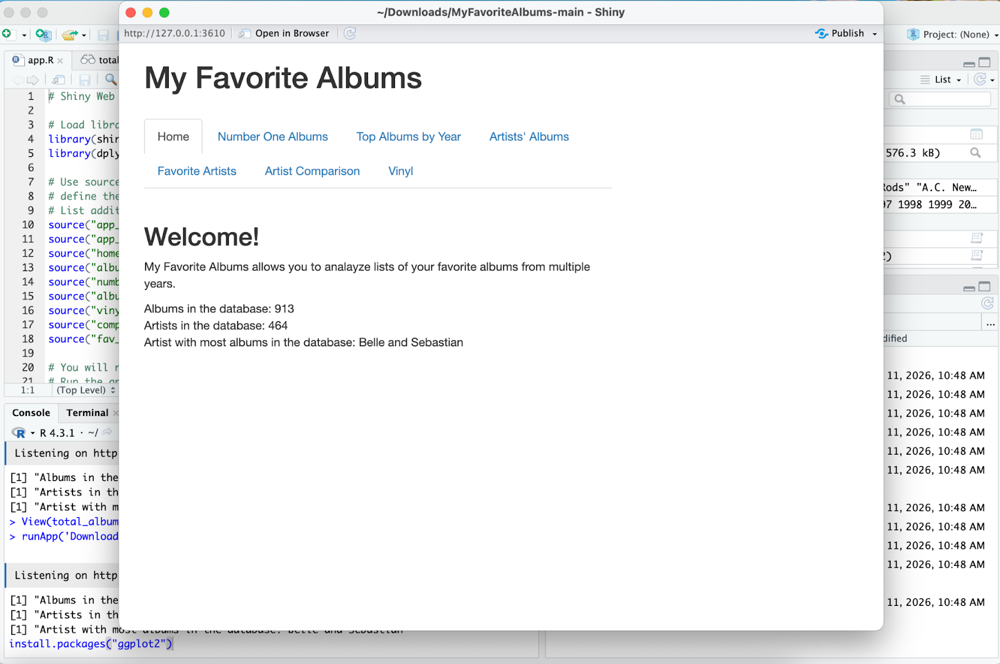

# Breakdown of MyFavoriteAlbums for Developers

  
  

**Goals**

-   Learn how the code for MyFavoriteAlbums runs
    

**What you Will need**

-   R studio
    
-   A Shinyapps.io account
    
-   Ability to run github
    

  

# Instructions

**Accessing Data Files from GitHub**

1.  Open the repository for MyFavoriteAlbums on GitHub via this link: [My Favorite Albums](https://github.com/UW-Example-Student/MyFavoriteAlbums).

2.  Click on the Green box titled “**Code**” in the top right corner. A dropdown menu should appear
    
3.  At the bottom of the dropdown, click on “Download Zip.”
    
4.  You should see all these files in your download history on your computer:
    

-   app.R
    
-   app_ui.R
    
-   app_server.R
    
-   home.R
    
-   albums_by_band.R
    
-   number_one_albums.R
    
-   albums_by_year.R
    
-   vinyl.R
    
-   compare_bands.R
    
-   fav_bands.R
    

  

**Transferring Data Files to R Studio**

1.  With the zip downloaded to your computer, open RStudio.
    
2.  On RStudio open the “Downloads” folder located in the bottom right corner.

3. In the “Downloads” folder you should see the zip folder of data from git hub, looking like this:

4.  Open this folder.
    
5.  Finally go to the file “app.R” and open it. Once clicking this file, on the top left of your screen in R studio, this code should pop up:

**Install Required Packages on R Studio**

1.  Navigate to the Console which is located at the bottom left of R Studio
    
2.  To install the shiny package, type this code: >install.packages(“shiny”)

3.  Press enter to load the shiny package.
    
4.  Next, download the dplyr package by typing in this code: >install.packages(“dplyr”)

5. Press enter to load the dplyr package.
6. Next, download the graph plot by typing in this code: >install.packages(“ggplot2”)

7.  Press enter to load the ggplot2 package.
    

**Run the Application**

1.  Click the Run App button on the top of code to launch the application.

MyFavoriteAlbums should launch in another window looking like this:

