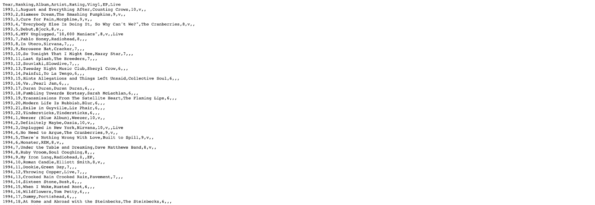

# Data Statement

The MyFavoriteAlbums application relies on a dataset stored in a CSV (Comma-Separated Values) file. This file contains ranked album information that powers the Shiny application. When the application runs, the CSV file is loaded into R as a data frame, which allows the app to filter, organize, and analyze the album data.

Each row in the dataset represents one album entry associated with a specific artist and year. The columns describe attributes of each album such as ranking position, rating, and format.

The dataset is used throughout the application to support features such as:

-   displaying album rankings by year
    
-   identifying number one albums
    
-   calculating favorite artists
    
-   filtering albums by rating or format
    
-   identifying albums owned on vinyl
    

Because the Shiny app relies on specific column names and formats, the dataset structure must remain consistent.

Here are examples of the raw code utilized:

