# How to Navigate MyFavoriteAlbums for Users

  
  

**Goals**

-   Learn how to navigate each tab within MyFavoriteAlbums
    
-   Learn how to use each filter and data visualization
    

  

**What you will need**

-   Functional Computer to open links
    
-   Browser that can run Shinyapps.io
    

  
  

# Instructions

**Opening Home Page**

1.  Open MyFavorite Albums via this link: [https://cholstro.shinyapps.io/shiny-music](https://cholstro.shinyapps.io/shiny-music).You should be brought to the home page of MyFavoriteAlbums which looks like the image below:
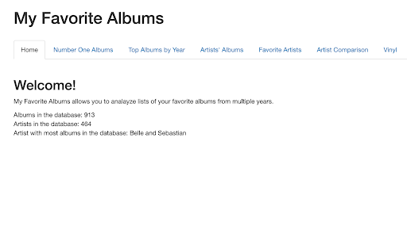

**Opening and Utilizing Number One Albums Tab**

1.  To open the first tab of MyFavoriteAlbums, click the light blue title: “Number One Albums” seen to the right of the Home tab.Your page should look like this:
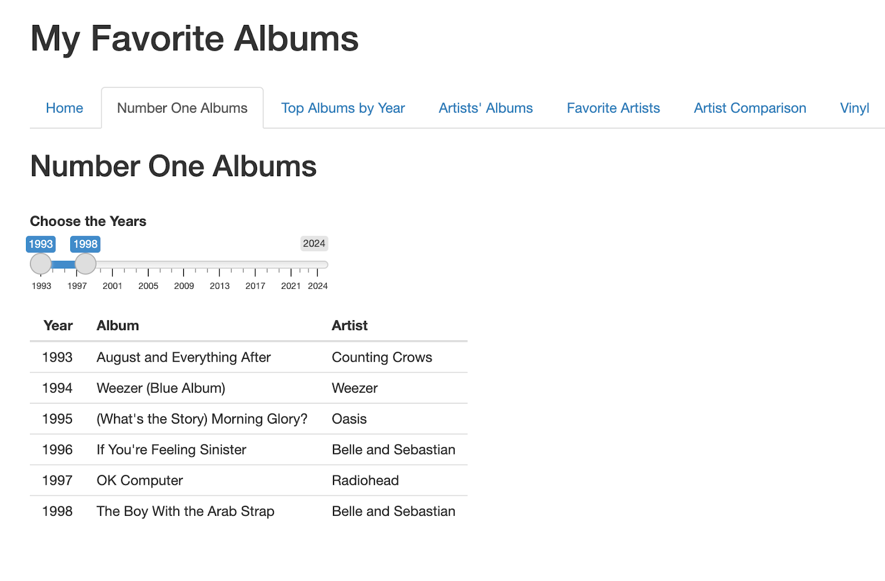
2. Click and drag the circle icons below “Choose the Years” to your desired year or years to display number one albums of that given year or range of years.

  

**Opening and Utilizing Top Albums by Year Tab**

1.  Click the light blue title: “Top Albums by Year”  located to the right of the “Number One Albums” tab. You will be brought to the page which looks like the image below:
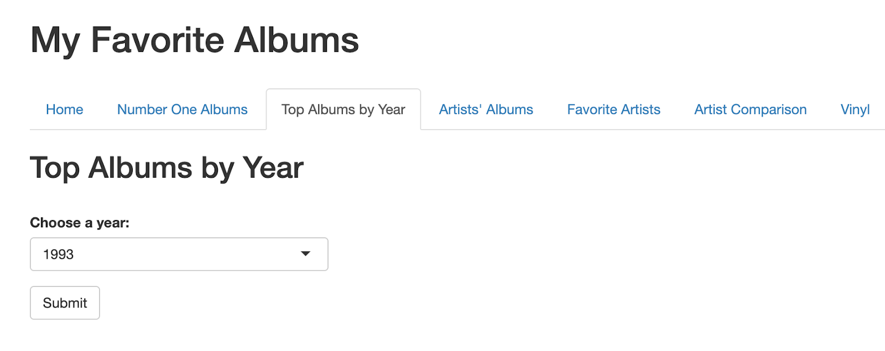
2.  Choose your desired year to observe by clicking on the drop box and selecting a year.
    
3.  After you have selected a year, press the Submit button located below the drop box.Once you press Submit , your screen will now have a ranking list of albums in the given year. For 1993, after submitting, your page should display this:
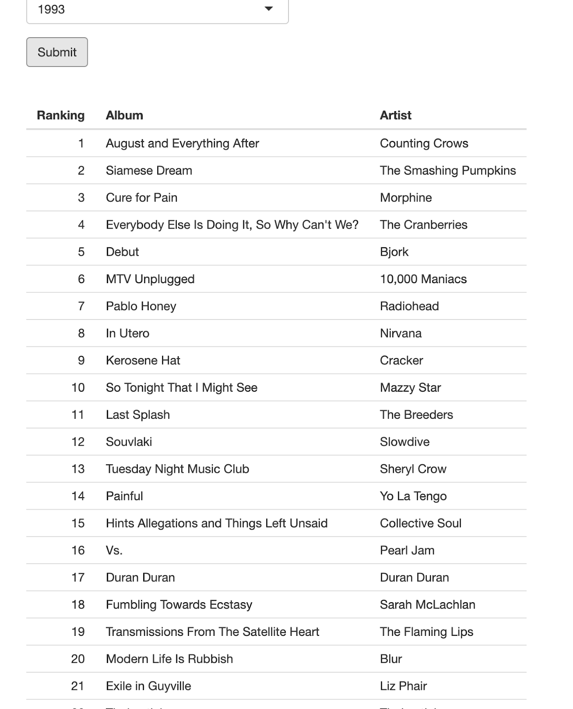

**Opening and Utilizing Artist’s Albums Tab**

1.  Click the light blue title: “Artist’s Albums,”  located to the right of the “Top Albums by Year” tab. You will be brought to the page which looks like the image below:
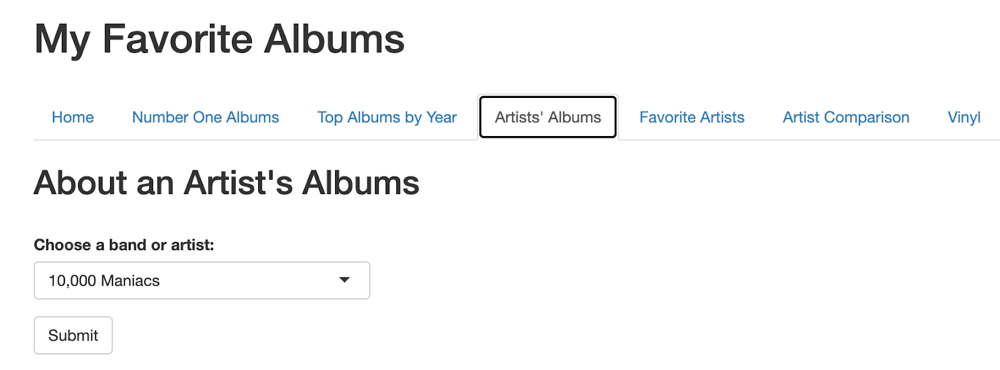
2.  Choose your desired band or artist to observe by clicking on the drop box and selecting a band or artist.
    
3.  After you have selected a band or artist, press the Submit button located below the drop box. Your screen will now have a rating list of albums by the given band or artist. For 10,000 Maniacs, after submitting, your page should display this:
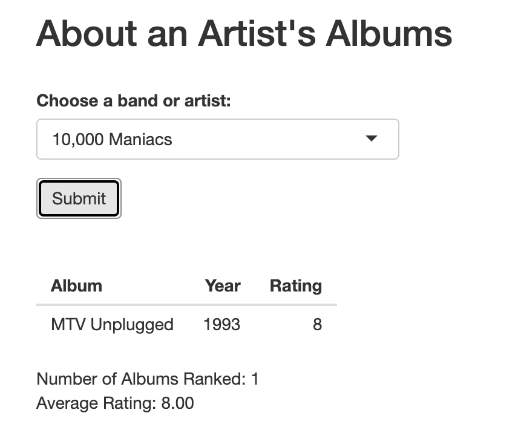

**Opening and Utilizing Favorite Artists Tab**

1.  Click the light blue title: “Favorite  Artists,”  located to the right of the “Artist’s Albums” tab. You will be brought to the page which looks like the image below:
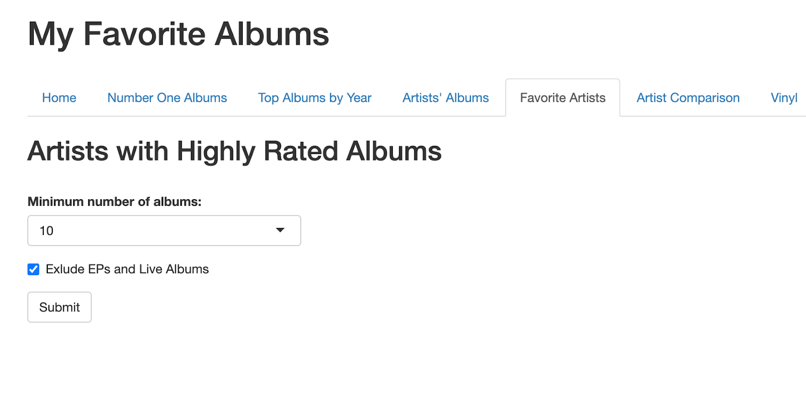
2.  Choose your desired minimum number of albums to observe by clicking on the drop box and selecting a number 1-10.
    
3.  After selecting a number, decide whether to check the filter:"Exclude EPs and Live Albums.”
    
4.  After you have selected a number and checked the filter or decided not to, press the **Submit** button located below the drop box. For a minimum number of 10 albums and the filter box selected to exclude, your page should look something like this:
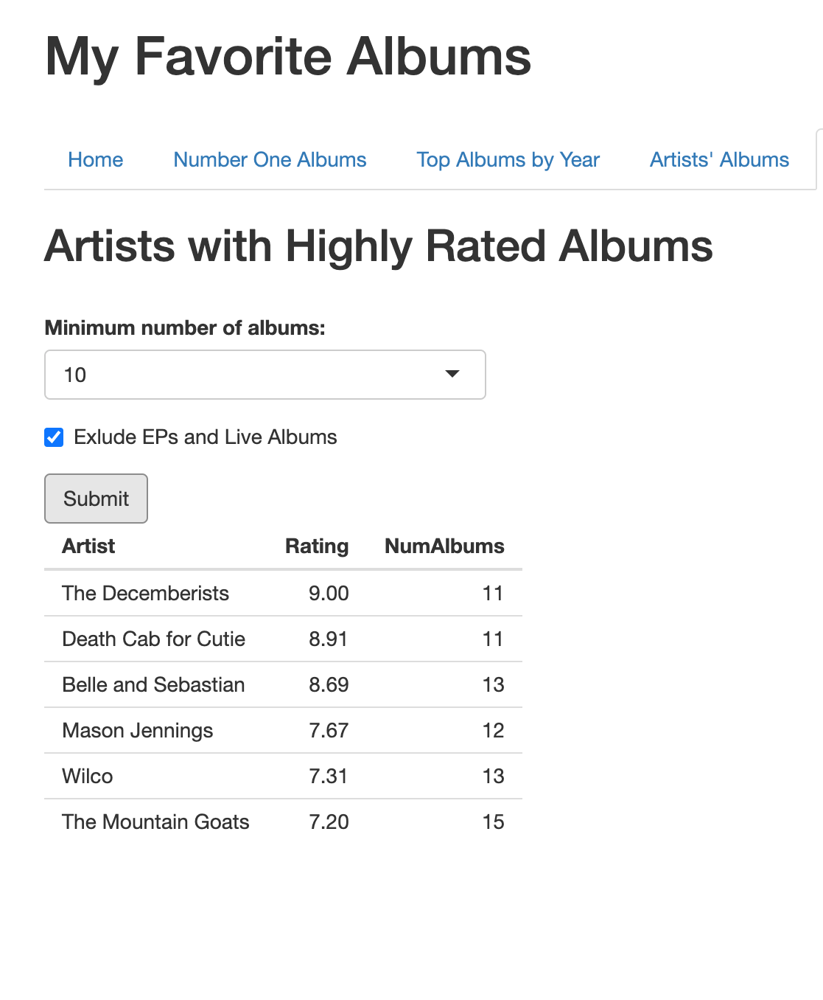

**Opening and Utilizing Artist Comparison Tab**

1.  Click the light blue title: “Artist Comparison,”  located to the right of the “Favorite  Artists” tab. You will be brought to the page which looks like the image below:
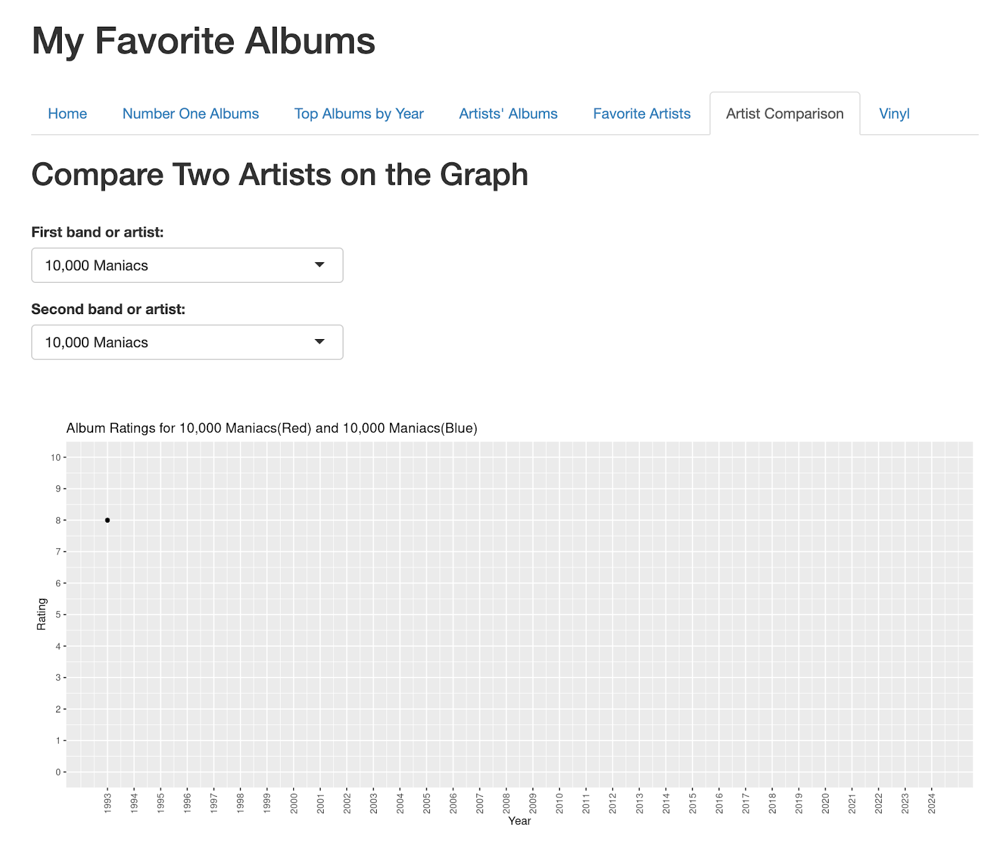
2.  Click the top drop down box to select an artist or band.
    
3.  Click the bottom drop down box to select another artist or band. In the instance of a comparison between 10,000 Maniacs and Beach House, your screen should display the following:
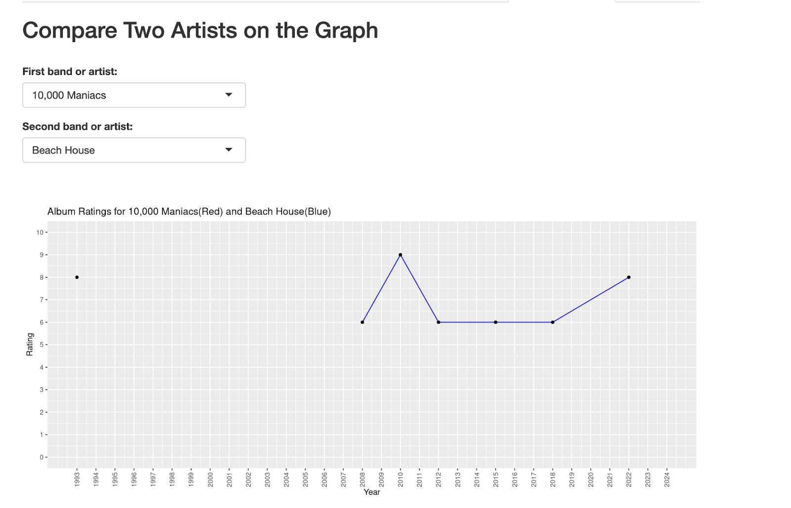

**Opening and Utilizing Vinyl Tab**

1.  Click the light blue title: “Vinyl,”  located to the right of the “Artist Comparison” tab. You will be brought to the page which looks like the image below:
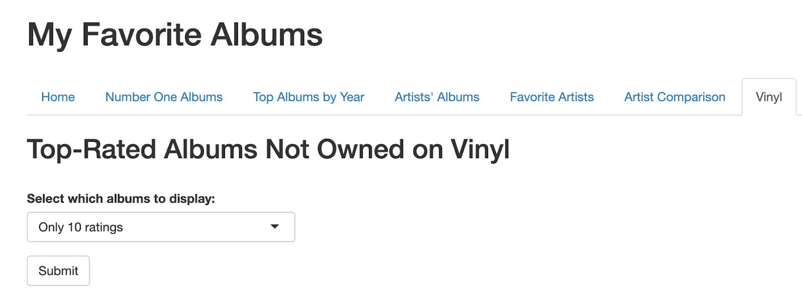
2.  Choose your desired albums with specific ratings to observe by clicking on the drop box and selecting a range of ratings.
    
3.  After you have selected a range, press the **Submit** button located below the drop box. Your screen will now have a rating list of albums with a rating of the desired range. For only 10 ratings, after submitting, your page should look like this:
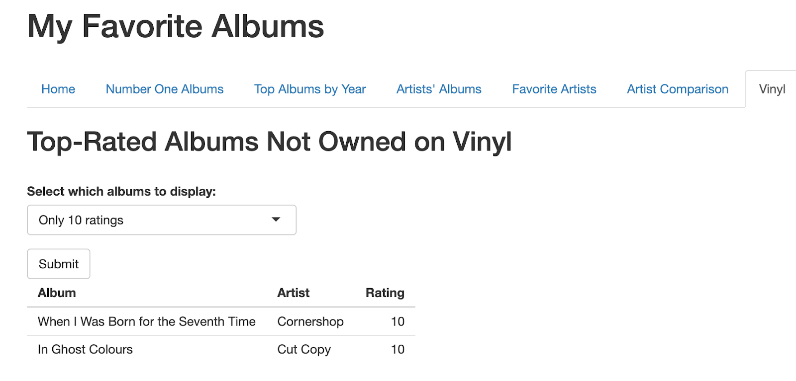
